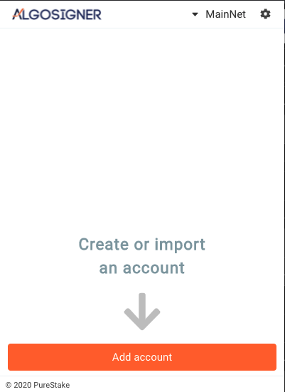
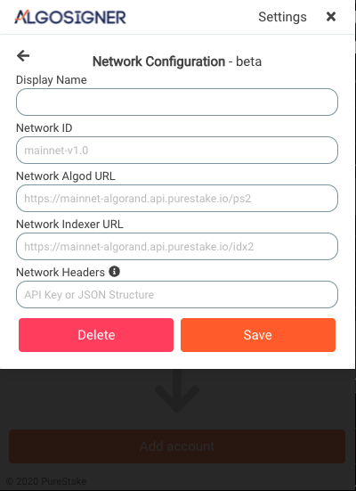

# Adding a New Network to AlgoSigner

AlgoSigner has built in access to the Algorand MainNet and TestNet. Settings for these networks are locked in the installed extension, although developers may modify the source code themselves and build a version with alternate settings.

Users may add additional networks to AlgoSigner through the extension settings. For example adding the Algorand BetaNet or a local network created by the [Algorand Sandbox](https://github.com/algorand/sandbox).

## Requirements

To add a new network you will need:

- Algod URL
- Indexer URL
- Network Id, which must be unique for your networks. This is listed as the `genesis-id` from the Algod API call "GET /versions" or from the the CLI command "goal node status"

- API Key, potenitally optional depending on API hosting

## Setup

- Open the extension and select the gear icon in the top right



- Select Network Configuration


- Select New Network


### Enter Settings



- Give the Network a name to identify it
- Add the unique Network Id (genesis-id)
- Add the URLs for Algod and Indexer, including port if necessary
- For the Network headers there are choices, depending on your API provider, see below for configuration details
- Save the new Network
- Add accounts to your new Network

Note, there is not yet a test feature for networks, but one is planned.

### Network Headers

For an instance of Algod that uses the X-Algo-API-Token, just enter it as text into the field.

To use a custom API key value in the header of each request, for example for the PureStake API service, construct a JSON object with key value pairs to be added to the request, broke out by Algod or Indexer, for example:

```JSON
{
	"Algod":
	{
		"x-api-key": "xxxxxxxxx"
	},
	"Indexer":
	{
		"x-api-key": "xxxxxxxxx"
	}
 }
```

Note, JSON object will need to be flattended to a single line.
