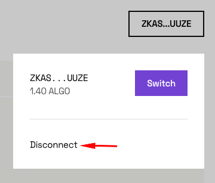
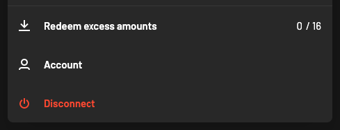
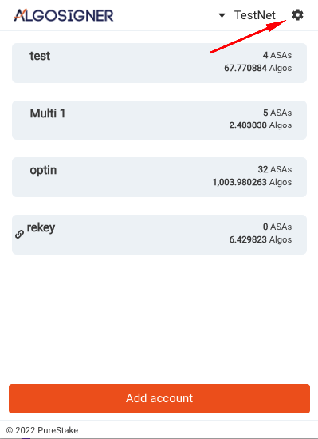
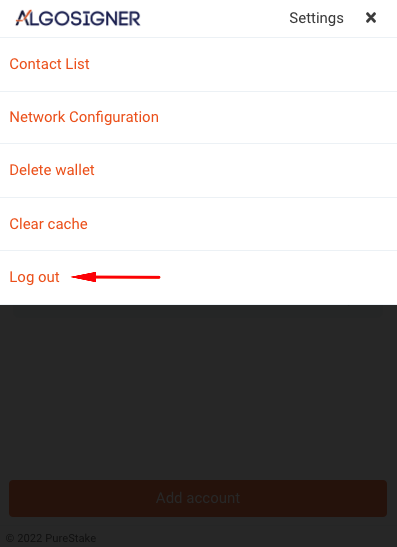
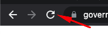
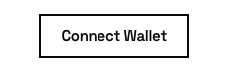

# AlgoSigner Connection Issues

If you're having issues accessing a dApp using AlgoSigner, you can try the following steps in order to delete any old existing connection that you may have lingering on the browser/website.

## Connection Troubleshooting

Find and press any 'Disconnect' button present on the dApp.

 

 

Open the config menu and log out of AlgoSigner.

 

Reload the tab/window where the dApp is open and attempt to connect again.

## Additional steps

If the issue persists, try deleting your local browser cache and cookies before attempting to connect to the dApp again.

[Steps for Chrome](https://support.google.com/accounts/answer/32050)

[Steps for Brave](https://support.brave.com/hc/en-us/articles/360048833872-How-Do-I-Clear-Cookies-And-Site-Data-In-Brave-)

