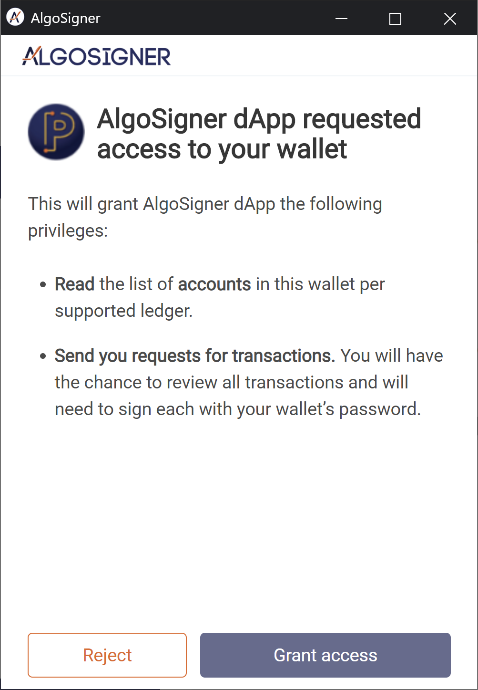

# 

# Integrating AlgoSigner to add Transaction Capabilities for dApps on Algorand

AlgoSigner injects a JavaScript library into every web page the browser user visits, which allows the site to interact with the extension. The dApp can use the injected library to connect to the user's Wallet, discover account addresses it holds, query the Network (make calls to AlgoD v2 or the Indexer) and request AlgoSigner to request for the user to sign a transaction initiated by the application. **All methods of the injected library return a Promise that needs to be handled by the dApp.**

This guide covers the new v2 Transactions Signing method, docs for the legacy v1 signing are [here](legacy-dApp-integration.md)

## Methods

- [AlgoSigner.connect()](#algosignerconnect)
- [AlgoSigner.accounts({ ledger: ‘MainNet|TestNet’ })](#algosigneraccounts-ledger-mainnettestnet-)
- [AlgoSigner.algod({ ledger: ‘MainNet|TestNet’, path: ‘algod v2 path’, ... })](#algosigneralgod-ledger-mainnettestnet-path-algod-v2-path--)
- [AlgoSigner.indexer({ ledger: ‘MainNet|TestNet’, path: ‘indexer v2 path’ })](#algosignerindexer-ledger-mainnettestnet-path-indexer-v2-path-)
- [AlgoSigner.signTxn([txnObjects,...])](#algosignersigntxntxnobjects)
- [AlgoSigner.send({ ledger: ‘MainNet|TestNet’, txBlob })](#algosignersend-ledger-mainnettestnet-txblob-)

## Misc

[Rejection Messages](#rejection-messages)

[Working with Custom Networks](#custom-networks)

[Helper Functions](#helper-functions)

## Method Detail

### AlgoSigner.connect()

Requests access to the Wallet for the dApp, may be rejected or approved. Every access to the extension begins with a connect request, which if approved by the user, allows the dApp to follow-up with other requests.



### AlgoSigner.accounts({ ledger: ‘MainNet|TestNet’ })

Returns an array of accounts present in the Wallet for the given Network.

**Request**

```js
AlgoSigner.accounts({ ledger: 'TestNet' });
```

**Response**

```json
[
  {
    "address": "U2VHSZL3LNGATL3IBCXFCPBTYSXYZBW2J4OGMPLTA4NA2CB4PR7AW7C77E"
  },
  {
    "address": "MTHFSNXBMBD4U46Z2HAYAOLGD2EV6GQBPXVTL727RR3G44AJ3WVFMZGSBE"
  }
]
```

## [API Calls](#api-calls)

Developers may use AlgoSigner's connection to Algorand and Indexer API services. This is an optional convienance, dApps may establish their own connections to retrieve parameters, query the Indexer, and send transactions to the chain.

Proxied requests are passed through to an API service - currently set to the PureStake API service. Endpoints available are limited to what the service exposes. The API backend may be configured by advanced users and is not guaranteed to respond as expected. Only text responses are supported for this service (not message packed).

### AlgoSigner.algod({ ledger: ‘MainNet|TestNet’, path: ‘algod v2 path’, ... })

Proxies the requested path to the Algod v2 API. Is limited to endpoints made available by the API server. By default, all calls to the AlgoSigner.algod method are GET.

**Request (GET)**

```js
AlgoSigner.algod({
  ledger: 'TestNet',
  path: '/v2/transactions/params',
});
```

**Response**

```json
{
  "consensus-version": "https://github.com/algorandfoundation/specs/tree/e5f565421d720c6f75cdd186f7098495caf9101f",
  "fee": 1,
  "genesis-hash": "SGO1GKSzyE7IEPItTxCByw9x8FmnrCDexi9/cOUJOiI=",
  "genesis-id": "testnet-v1.0",
  "last-round": 8271323,
  "min-fee": 1000
}
```

To make a POST requests, more details need to be included in as input. More information can be found [here](https://developer.algorand.org/docs/reference/rest-apis/algod/v2/).

**Request (POST)**

```js
AlgoSigner.algod({
  ledger: 'TestNet',
  path: '/v2/teal/compile',
  body: 'int 0',
  method: 'POST',
  contentType: 'text/plain',
});
```

**Response**

```json
{
  "hash": "KI4DJG2OOFJGUERJGSWCYGFZWDNEU2KWTU56VRJHITP62PLJ5VYMBFDBFE",
  "result": "ASABACI="
}
```

### AlgoSigner.indexer({ ledger: ‘MainNet|TestNet’, path: ‘indexer v2 path’ })

Proxies the requested path to the Indexer v2 API. Is limited to endpoints made available by the API server. The API backend may be configured by advanced users and is not guaranteed to respond as expected. More information can be found [here](https://developer.algorand.org/docs/reference/rest-apis/algod/v2/).

**Request**

```js
AlgoSigner.indexer({
  ledger: 'TestNet',
  path: '/v2/assets/150821',
});
```

**Response**

```json
{
  "asset": {
    "index": 150821,
    "params": {
      "clawback": "Q2SLSQTBMVJYVT2AANUAXY4A5G7A3Y6L2M6L3WIXKNYBTMMQFGUOQGKSRQ",
      "creator": "Q2SLSQTBMVJYVT2AANUAXY4A5G7A3Y6L2M6L3WIXKNYBTMMQFGUOQGKSRQ",
      "decimals": 15,
      "default-frozen": false,
      "freeze": "Q2SLSQTBMVJYVT2AANUAXY4A5G7A3Y6L2M6L3WIXKNYBTMMQFGUOQGKSRQ",
      "manager": "Q2SLSQTBMVJYVT2AANUAXY4A5G7A3Y6L2M6L3WIXKNYBTMMQFGUOQGKSRQ",
      "name": "decimal Test",
      "reserve": "Q2SLSQTBMVJYVT2AANUAXY4A5G7A3Y6L2M6L3WIXKNYBTMMQFGUOQGKSRQ",
      "total": 1000,
      "unit-name": "dectest"
    }
  },
  "current-round": 8271410
}
```

## Working with Transactions

Sent in transactions will be validated against the Algorand JS SDK transaction types - field names must match, and the whole transaction will be rejected otherwise.

This section covers the new v2 Signing. Additional end-to-end examples will be included in the next weeks.

### AlgoSigner.signTxn([txnObjects,...])

Send transaction objects, conforming to the Algorand JS SDK, to AlgoSigner for approval. The Network is determined from the 'genesis-id' property. If approved, the response is an array of signed transaction objects, with the binary blob field base64 encoded to prevent transmission issues.

#### Transaction Requirements

Transactions objects need to be presented with the following structure:

```
{
  txn: Base64-encoded string of a transaction binary,
  signers?: [optional] array of addresses to sign with (defaults to the sender),
  multisig?: [optional] extra metadata needed for multisig transactions,
};
```

In order to facilitate conversion between different formats and encodings, [helper functions](#helper-functions) are available on the `AlgoSigner.encoding.*` namespace.

Also available on transactions built with the JS SDK is the `.toByte()` method that converts the SDK transaction object into it's binary format.

**Request**

```js
AlgoSigner.signTxn([
  {
    txn: 'iqNhbXRko2ZlZc0D6KJmds4A259Go2dlbqx0ZXN0bmV0LXYxLjCiZ2jEIEhjtRiks8hOyBDyLU8QgcsPcfBZp6wg3sYvf3DlCToio2dycMQgdsLAGqgrtwqqQS4UEN7O8CZHjfhPTwLHrB1A2pXwvKGibHbOANujLqNyY3bEIK0TEDcptY0uFvk2V5LDVzRfdz7O4freYHEuZbpI+6hMo3NuZMQglmyhKUPeU2KALzt/Jcs0GQ55k2vsqZ4pGeNlzpnYLbukdHlwZaNwYXk=',
  },
]);
```

**NOTE:** Even though the method accepts an array of transactions, it requires atomic transactions that have a groupId and will error on non-atomic groups.

**Response**

```json
[
  {
    "txID": "4F6GE5EBTBJ7DOTWKA3GK4JYARFDCVR5CYEXP6O27FUCE5SGFDYQ",
    "blob": "gqNzaWfEQL6mW/7ss2HKAqsuHN/7ePx11wKSAvFocw5QEDvzSvrvJdzWYvT7ua8Lc0SS0zOmUDDaHQC/pGJ0PNqnu7W3qQKjdHhuiaNhbXQGo2ZlZc4AA7U4omZ2zgB+OrujZ2VurHRlc3RuZXQtdjEuMKJnaMQgSGO1GKSzyE7IEPItTxCByw9x8FmnrCDexi9/cOUJOiKibHbOAH4+o6NyY3bEIHhydylNDQQhpD9QdKWejLCMBgb5UYJTGCfDW3KgLsI+o3NuZMQgZM5ZNuFgR8pz2dHBgDlmHolfGgF96zX/X4x2bnAJ3aqkdHlwZaNwYXk="
  }
]
```

**Example**

```js
await AlgoSigner.connect();

// Create an Algod client to get suggested transaction params
let client = new algosdk.Algodv2(token, server, port, headers);
let suggestedParams = await client.getTransactionParams().do();

// Use the JS SDK to build a Transaction
let sdkTx = new algosdk.Transaction({
  to: 'RECEIVER_ADDRESS',
  from: 'SENDER_ADDRESS',
  amount: 100,
  ...suggestedParams,
});

// Get the binary and base64 encode it
let binaryTx = sdkTx.toByte();
let base64Tx = AlgoSigner.encoding.msgpackToBase64(binaryTx);

let signedTxs = await AlgoSigner.signTxn([
  {
    txn: base64Tx,
  },
]);
```
Alternatively, you can provide multiple arrays of transactions at once. Same rules regarding the contents of the groups apply.

**Request**

```js
AlgoSigner.signTxn([
  [
    {
      txn: 'iqNhbXRko2ZlZc0D6KJmds4A259Go2dlbqx0ZXN0bmV0LXYxLjCiZ2jEIEhjtRiks8hOyBDyLU8QgcsPcfBZp6wg3sYvf3DlCToio2dycMQgdsLAGqgrtwqqQS4UEN7O8CZHjfhPTwLHrB1A2pXwvKGibHbOANujLqNyY3bEIK0TEDcptY0uFvk2V5LDVzRfdz7O4freYHEuZbpI+6hMo3NuZMQglmyhKUPeU2KALzt/Jcs0GQ55k2vsqZ4pGeNlzpnYLbukdHlwZaNwYXk=',
    },
  ],
  [
    {
      txn: 'iaRhZnJ6w6RmYWRkxCCWbKEpQ95TYoAvO38lyzQZDnmTa+ypnikZ42XOmdgtu6RmYWlkzgDITmiiZnbOAQNjIKNnZW6sdGVzdG5ldC12MS4womdoxCBIY7UYpLPITsgQ8i1PEIHLD3HwWaesIN7GL39w5Qk6IqJsds4BA2cIo3NuZMQglmyhKUPeU2KALzt/Jcs0GQ55k2vsqZ4pGeNlzpnYLbukdHlwZaRhZnJ6',
    },
  ],
]);
```
**Response**

```json
[
  [
    {
      "txID": "4F6GE5EBTBJ7DOTWKA3GK4JYARFDCVR5CYEXP6O27FUCE5SGFDYQ",
      "blob": "gqNzaWfEQL6mW/7ss2HKAqsuHN/7ePx11wKSAvFocw5QEDvzSvrvJdzWYvT7ua8Lc0SS0zOmUDDaHQC/pGJ0PNqnu7W3qQKjdHhuiaNhbXQGo2ZlZc4AA7U4omZ2zgB+OrujZ2VurHRlc3RuZXQtdjEuMKJnaMQgSGO1GKSzyE7IEPItTxCByw9x8FmnrCDexi9/cOUJOiKibHbOAH4+o6NyY3bEIHhydylNDQQhpD9QdKWejLCMBgb5UYJTGCfDW3KgLsI+o3NuZMQgZM5ZNuFgR8pz2dHBgDlmHolfGgF96zX/X4x2bnAJ3aqkdHlwZaNwYXk="
    }
  ],
  [
    {
      "txID": "QK4XYJYGN7CLER25SKT3DV4UWNI5DVYXRBJRZEUWYA523EU5ZB7A",
      "blob": "gqNzaWfEQC8ZIPYimAypJD2TmEQjuWxEEk8/gJbBegEHdtyKr6TuA78otKIEB9PYQimgMLGn87YOEB6GgRe5vjWRTuWGsAqjdHhuiaRhZnJ6w6RmYWRkxCCWbKEpQ95TYoAvO38lyzQZDnmTa+ypnikZ42XOmdgtu6RmYWlkzgDITmiiZnbOAQNjO6NnZW6sdGVzdG5ldC12MS4womdoxCBIY7UYpLPITsgQ8i1PEIHLD3HwWaesIN7GL39w5Qk6IqJsds4BA2cjo3NuZMQglmyhKUPeU2KALzt/Jcs0GQ55k2vsqZ4pGeNlzpnYLbukdHlwZaRhZnJ6"
    }
  ]
]
```

The signed transactions can then be sent using the SDK (example below) or using the [AlgoSigner.send()](#algosignersend-ledger-mainnettestnet-txblob-) method.

```js
// Get the base64 encoded signed transaction and convert it to binary
let binarySignedTx = AlgoSigner.encoding.base64ToMsgpack(signedTxs[0].blob);

// Send the transaction through the SDK client
await client.sendRawTransaction(binarySignedTx).do();
```

#### Atomic Transactions

For Atomic transactions, provide an array of transaction objects with the same group ID, _provided in the same order as when the group was assigned_.

**Example**

```js
let tx1 = new algosdk.Transaction({
  to: 'SECOND_ADDRESS',
  from: 'FIRST_ADDRESS',
  amount: 100,
  ...suggestedParams,
});
let tx2 = new algosdk.Transaction({
  to: 'FIRST_ADDRESS',
  from: 'SECOND_ADDRESS',
  amount: 100,
  ...suggestedParams,
});

// Assign a Group ID to the transactions using the SDK
algosdk.assignGroupID([tx1, tx2]);

let binaryTxs = [tx1.toByte(), tx2.toByte()];
let base64Txs = binaryTxs.map((binary) => AlgoSigner.encoding.msgpackToBase64(binary));

let signedTxs = await AlgoSigner.signTxn([
  {
    txn: base64Txs[0],
  },
  {
    txn: base64Txs[1],
  },
]);
```

The signed transaction array can then be sent using the SDK.

```js
let binarySignedTxs = signedTxs.map((tx) => AlgoSigner.encoding.base64ToMsgpack(tx.blob));
await client.sendRawTransaction(binarySignedTxs).do();
```

In case not all group transactions belong to accounts on AlgoSigner, you can set the `signers` field of the transaction object as an empty array to specify that it's only being sent to AlgoSigner for reference and group validation, not for signing.

_AlgoSigner.signTxn()_ will return _null_ in it's response array for the positions were reference transactions were sent.

In these cases, you'd have to sign the missing transaction by your own means before it can be sent (by using the SDK, for instance).

```js
let tx1 = new algosdk.Transaction({
  to: 'EXTERNAL_ACCOUNT',
  from: 'ACCOUNT_IN_ALGOSIGNER',
  amount: 100,
  ...suggestedParams,
});
let tx2 = new algosdk.Transaction({
  to: 'ACCOUNT_IN_ALGOSIGNER',
  from: 'EXTERNAL_ACCOUNT',
  amount: 100,
  ...suggestedParams,
});

algosdk.assignGroupID([tx1, tx2]);
let binaryTxs = [tx1.toByte(), tx2.toByte()];
let base64Txs = binaryTxs.map((binary) => AlgoSigner.encoding.msgpackToBase64(binary));

let signedTxs = await AlgoSigner.signTxn([
  {
    txn: base64Txs[0],
  },
  {
    // This tells AlgoSigner that this transaction is not meant to be signed
    txn: base64Txs[1],
    signers: [],
  },
]);
```

Signing the remaining transaction with the SDK would look like this:

```js
// The AlgoSigner.signTxn() response would look like '[{ txID, blob }, null]'
// Convert first transaction to binary from the response
let signedTx1Binary = AlgoSigner.encoding.base64ToMsgpack(signedTxs[0].blob);
// Sign leftover transaction with the SDK
let externalAccount = algosdk.mnemonicToSecretKey('EXTERNAL_ACCOUNT_MNEMONIC');
let signedTx2Binary = tx2.signTxn(externalAccount.sk);

await client.sendRawTransaction([signedTx1Binary, signedTx2Binary]).do();
```

Alternatively, if you're using the [AlgoSigner.send()](#algosignersend-ledger-mainnettestnet-txblob-) to send the transaction, you have to merge the binaries before converting to a base64 encoded string.

```js
// Merge transaction binaries into a single Uint8Array
let combinedBinaryTxns = new Uint8Array(signedTx1Binary.byteLength + signedTx2Binary.byteLength);
combinedBinaryTxns.set(signedTx1Binary, 0);
combinedBinaryTxns.set(signedTx2Binary, signedTx1Binary.byteLength);

// Convert the combined array values back to base64
let combinedBase64Txns = AlgoSigner.encoding.msgpackToBase64(combinedBinaryTxns);

await AlgoSigner.send({
  ledger: 'TestNet',
  tx: combinedBase64Txns,
});
```

### Multisig Transactions

For Multisig transactions, an additional metadata object is required that adheres to the [Algorand multisig parameters](https://developer.algorand.org/docs/features/accounts/create/#how-to-generate-a-multisignature-account) structure when creating a new multisig account:

```js
{
  version: number,
  threshold: number,
  addrs: string[]
}
```

`AlgoSigner.signTxn()` will validate that the resulting multisig address made from the provided parameters matches the sender address and try to sign with every account on the `addrs` array that is also on AlgoSigner.

**NOTE:** `AlgoSigner.signTxn()` only accepts unsigned multisig transactions. In case you need to add more signatures to partially signed multisig transactions, please use the SDK.

**Example**

```js
let multisigParams = {
  version: 1,
  threshold: 1,
  addrs: ['FIRST_ADDRESS', 'SECOND_ADDRESS', 'ADDRESS_NOT_IN_ALGOSIGNER'],
};

let multisigAddress = algosdk.multisigAddress(multisigParams);

let multisigTx = new algosdk.Transaction({
  to: 'RECEIVER_ADDRESS',
  from: multisigAddress,
  amount: 100,
  ...suggestedParams,
});

// Get the binary and base64 encode it
let binaryMultisigTx = multisigTx.toByte();
let base64MultisigTx = AlgoSigner.encoding.msgpackToBase64(binaryMultisigTx);

// This returns a partially signed Multisig Transaction with signatures for FIRST_ADDRESS and SECOND_ADDRESS
let signedTxs = await AlgoSigner.signTxn([
  {
    txn: base64MultisigTx,
    msig: multisigParams,
  },
]);
```

In case you want to specify a subset of addresses to sign with, you can add them to the `signers` list on the transaction object, like so:

```js
// This returns a partially signed Multisig Transaction with signatures for SECOND_ADDRESS
let signedTxs = await AlgoSigner.signTxn([
  {
    txn: base64MultisigTx,
    msig: multisigParams,
    signers: ['SECOND_ADDRESS'],
  },
]);
```

### AlgoSigner.send({ ledger: ‘MainNet|TestNet’, txBlob })

Send a base64 encoded signed transaction blob to AlgoSigner to transmit to the Network.

**Request**

```js
AlgoSigner.send({
  ledger: 'TestNet',
  tx: signedTx.blob,
});
```

**Response**

```json
{ "txId": "OKU6A2QYMRSZAUEJUZL3PW5XKLTA6TKWQHIIBXDCO3KT5OHCULBA" }
```

## Custom Networks

- Custom networks beta support is now in AlgoSigner. [Setup Guide](add-network.md)
- AlgoSigner.accounts(ledger) has changed such that calls now accept names that have been added to the user's custom network list as valid ledger names.
  - A non-matching ledger name will result in a error:
    - [RequestError.UnsupportedLedger] The provided ledger is not supported.
  - An empty request will result with an error:
    - Ledger not provided. Please use a base ledger: [TestNet,MainNet] or an available custom one [{"name":"Theta","genesisId":"thetanet-v1.0"}].
- Transaction requests will require a valid matching "genesisId", even for custom networks.

## Rejection Messages

The dApp may return the following errors in case of users rejecting requests, or errors in the request:

```
    NotAuthorized = '[RequestError.NotAuthorized] The extension user does not authorize the request.',
    UnsupportedAlgod = '[RequestError.UnsupportedAlgod] The provided method is not supported.',
    UnsupportedLedger = '[RequestError.UnsupportedLedger] The provided ledger is not supported.',
    InvalidFormat = '[RequestError.InvalidFormat] Please provide an array of either valid transaction objects or nested arrays of valid transaction objects.',
    Undefined = '[RequestError.Undefined] An undefined error occurred.',
```

Errors may be passed back to the dApp from the Algorand JS SDK if a transaction is valid, but has some other issue - for example, insufficient funds in the sending account.

## Helper Functions

`AlgoSigner.enconding.*` contains a few different methods in order to help with the different formats and encodings that are needed when working with dApps and the SDK.

```
  AlgoSigner.encoding.msgpackToBase64(): receives a binary object (as a Uint8Array) and returns the corresponding base64 encoded string,
  AlgoSigner.encoding.base64ToMsgpack(): receives a base64 encoded string and returns the corresponding binary object (as a Uint8Array),
  AlgoSigner.encoding.stringToByteArray(): receives a plain unencoded string and returns the corresponding binary object (as a Uint8Array),
  AlgoSigner.encoding.byteArrayToString(): receives a binary object (as a Uint8Array) and returns the corresponding plain unencoded string,
```
