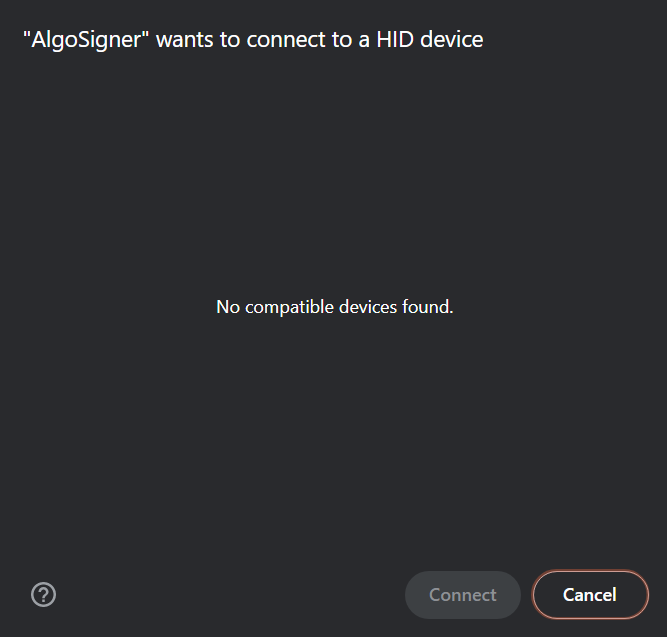
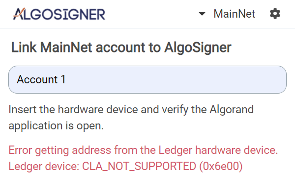
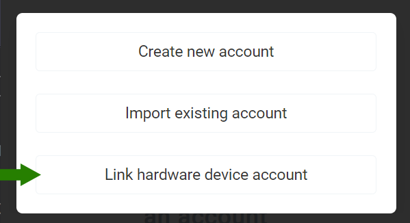
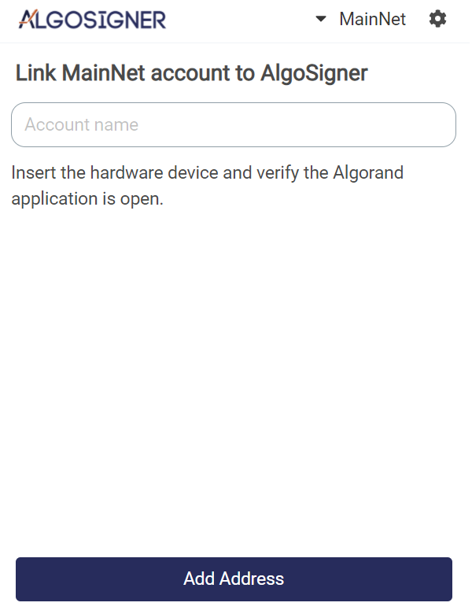
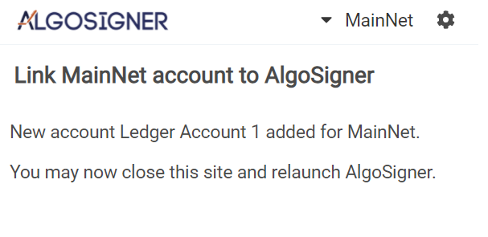
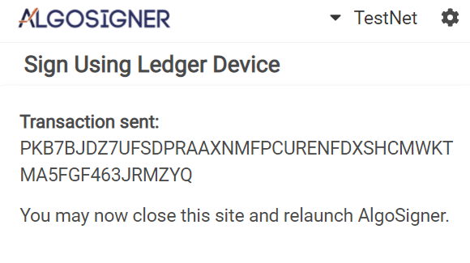
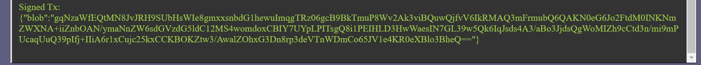
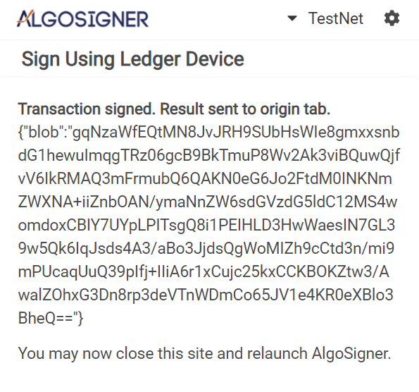

# AlgoSigner Ledger Periphreral Hardware Actions

## Overview:

Allow the AlgoSigner extension to work with Ledger device accounts via HID for transaction signing on pay and asset transactions. This includes transactions originating in the extension and from DApps. It does not work with multiple transactions found in groups and multisig.  

It supports adding the account to your normal accounts tracking in the extension to supply both methods with the ability to sign. 

## Common Errors:

During any action the ledger device may prompt to connect. If the device is not connected then the screen may be blank.

  

If the device is connected, but the app is not open you may recieve a not supported error.

  

## Adding an address:

Open AlgoSigner and go to the default account overview.
With the desired network selected click the "Add Account" button at the bottom of the page.
Then choose "Link hardware device account" from the options.

  

The page will inform you that it must open AlgoSigner in a tab to connect to the device. Press "Continue".
A new tab should open in the window where AlgoSigner is active. 

  

Populate the Account name field with the value name of the new account.
Verify the device is connected, unlocked and that the Algorand application is installed and active then press "Add Address".
This will get the default account for the connected device.
Once this address is obtained it will be added to your AlgoSigner account and you are free to close the tab.

  

## Signing with the extension:

First you must add an address to the appropriate network.
With the proper network added you can select the account from the list of accounts. 
This will show you the normal account information and give you the option to "Send" as normal.
After entering your transaction information and choosing to send you will be prompted for your password. 
Once your password is deemed correct and the address is internally determined to be a hardware account a new tab will automatically open. Here you will be presented with a similar transaction view to one seen from DApps in the extension. 

  

You can review here, but you should verify ALL data thoroughly from the Ledger device. 
Verify the device is connected, unlocked and that the Algorand application is installed and active then press "Send to device".
After signing you will be presented with the transaction id and the transaction will be sent to the network.
You are then free to close the tab. 

  

## Signing with a DApp:

First the user must add an address to the appropriate network.
A transanction can be then be sent with the network and matching Ledger address. 
The user will be presented with the normal sign page.
Once the password is deemed correct and the address is internally determined to be a hardware account a new tab will automatically open.
The new tab will show the same information the user just seen on the normal sign screen. 
They are free to review here, but should verify ALL data thoroughly from the Ledger device. 
Verify the device is connected, unlocked and that the Algorand application is installed and active then press "Send to device".
After signing the blob will be sent back to the DApp tab in the same way that a transaction sign normally does from AlgoSigner. 

  

The blob will also be presented to the user indicating they are free to close the tab. 

  